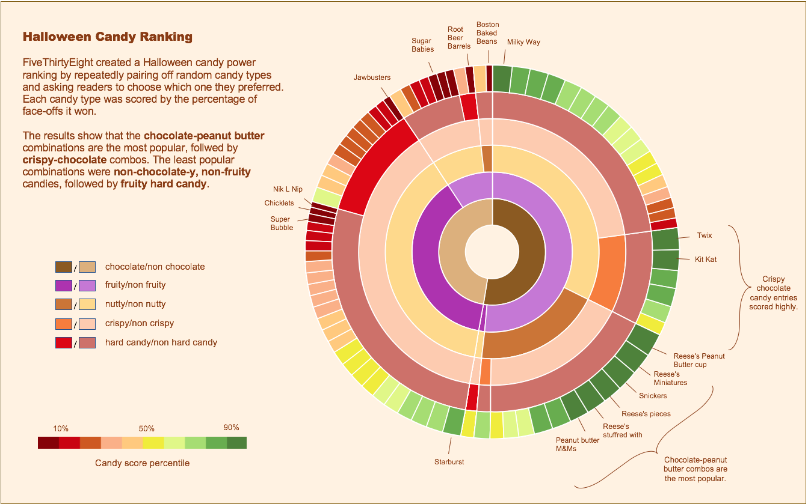

# Radial Garden

A radial chart visualization for planning flower gardens throughout the year. Users select flowers from a catalog and see their yearly lifecycle rendered as concentric rings on a circular chart divided into twelve monthly segments.


*Inspired by the FiveThirtyEight Halloween Candy Ranking radial chart.*

## Concept

The chart is a **radial heatmap** where:

- The circle is divided into **12 equal slices**, one per month (January at the top, proceeding clockwise).
- Each **concentric ring** represents one flower selected by the user.
- Each **cell** (the intersection of a month-slice and a flower-ring) is filled with a color representing the flower's **phenological state** in that month.
- The chart has a **fixed outer radius**. As flowers are added, rings subdivide the available space — each ring gets thinner. When flowers are removed, the remaining rings expand to fill the circle again.
- A minimum inner radius leaves an empty center.

## Flower States and Colors

Each flower has a state for each month. There are four possible states, each with a default color:

| State | Default Color | Description |
|---|---|---|
| Dormant | `#8B7355` (warm brown) | Underground or inactive, no visible growth |
| Sprouting | `#90EE90` (light green) | New shoots emerging |
| Foliage | `#228B22` (forest green) | Actively growing leaves, no blooms |
| Blooming | `#E84393` (pink) | In full flower |

Each flower can **override any or all** of these default colors with its own palette. This allows, for example, a lavender to bloom in purple and a sunflower to bloom in yellow, while both share the same default brown for dormancy.

## Data Model

Each flower entry:

```json
{
  "id": "lavender",
  "name": "Lavender",
  "colors": {
    "blooming": "#9B59B6"
  },
  "months": {
    "1-2": "dormant",
    "3": "sprouting",
    "4-5": "foliage",
    "6-8": "blooming",
    "9-10": "foliage",
    "11-12": "dormant"
  }
}
```

### Month notation

The `months` object uses **month numbers** (1 = January, 12 = December) as keys. Keys can be:

- A single month: `"3": "sprouting"`
- A range: `"6-8": "blooming"` (equivalent to setting months 6, 7, and 8)
- Individual entries: `"1": "dormant", "2": "dormant"` (equivalent to `"1-2": "dormant"`)

Ranges and individual entries can be mixed freely. Every month (1–12) must be covered exactly once. At parse time, ranges are expanded into per-month state lookups.

### Fields

- `id` — unique identifier.
- `name` — display name.
- `colors` — optional. Per-state color overrides. Any state not specified falls back to the default palette.
- `months` — required. Maps month numbers/ranges to states.

The app ships with a **built-in catalog** of common garden flowers with pre-filled phenological data.

## User Interface

### Layout

```
┌──────────────────────────────────────────────────┐
│  ┌────────────┐   ┌────────────────────────────┐ │
│  │            │   │                            │ │
│  │  Flower    │   │                            │ │
│  │  List      │   │     Radial Chart           │ │
│  │  (sidebar) │   │                            │ │
│  │            │   │                            │ │
│  │            │   │                            │ │
│  └────────────┘   └────────────────────────────┘ │
└──────────────────────────────────────────────────┘
```

### Sidebar — Flower List

- Displays the **full catalog** of flowers as a scrollable list.
- Each flower row shows:
  - The **flower name**.
  - A **checkbox** to select/deselect it.
- **Selected flowers** appear checked and are rendered on the chart.
- Users can **drag to reorder** selected flowers — the order determines which ring they occupy (top of list = innermost ring).
- A **search/filter** input at the top to quickly find flowers.

### Radial Chart

- Renders only the **selected** flowers.
- **Fixed circle size** — rings subdivide the available radius evenly among selected flowers.
- **Month labels** appear around the outside of the chart (abbreviated: Jan, Feb, ..., Dec).
- **Flower names** are rendered as **curved text** along the middle of each ring, following the arc's curvature. The text sits centered vertically within the ring's band.
- **Smooth transitions** (D3 transitions) when flowers are added, removed, or reordered:
  - Adding a flower: rings redistribute to accommodate the new entry.
  - Removing a flower: remaining rings expand to fill the space.
  - Reordering: rings animate to their new positions.
- **Hover interaction**: hovering a cell shows a tooltip with the flower name, month, and state.
- **Thin dividing lines** between months (radial lines from center to edge) and between flowers (concentric circle outlines) for readability.

## Technology

- **Vite** — build tool and dev server.
- **React** — UI framework for the sidebar, controls, and layout.
- **D3.js** — radial chart rendering (arcs, scales, transitions, color utilities).
- **CSS** — styling; no CSS framework.
- No backend. All data is client-side. State is ephemeral (no persistence needed for v1).

## Chart Construction Details

The chart is an SVG built with D3:

1. **Angle scale**: `d3.scaleLinear` mapping month index `[0, 12]` to `[0, 2 * Math.PI]`. January starts at the top (angle 0 = 12 o'clock, using a `-Math.PI / 2` offset).
2. **Radius scale**: The fixed outer radius minus the inner radius gives the available band. This band is divided equally among selected flowers. Each flower gets `bandHeight = availableBand / numberOfFlowers`.
3. **Cells**: Each cell is a `d3.arc()` with:
   - `innerRadius` / `outerRadius` from the flower's band.
   - `startAngle` / `endAngle` from the month's slice.
4. **Colors**: Resolved per cell — look up the flower's state for that month, then resolve the color from the flower's custom palette with fallback to defaults.
5. **Curved text**: Flower names rendered along a `<textPath>` referencing a circular `<path>` at the midpoint radius of each ring.

## Design

- **White background** (`#FFFFFF`), clean and minimal.
- **Monospaced font** (e.g., `"JetBrains Mono"`, `"Fira Code"`, or `"SF Mono"` with `monospace` fallback) for all text — labels, sidebar, headings.
- **Rounded shapes**: arc cells rendered with slight corner rounding where possible. Buttons and inputs use generous `border-radius`.
- **Minimalist UI**: no legend, no excessive decoration. The chart and sidebar speak for themselves.
- **Subtle borders**: thin, light gray lines for structure. No heavy outlines.
- **Responsive**: the chart maintains its fixed size but centers itself in available space. The sidebar collapses or scrolls on smaller viewports.

## Catalog (v1)

Include at least 20 flowers spanning different bloom seasons. Examples:

| Flower | Bloom Color | Bloom Months |
|---|---|---|
| Lavender | Purple | Jun–Aug |
| Sunflower | Yellow | Jul–Sep |
| Tulip | Red | Mar–May |
| Daffodil | Yellow | Feb–Apr |
| Rose | Pink | May–Oct |
| Chrysanthemum | Orange | Sep–Nov |
| Snowdrop | White | Jan–Mar |
| Dahlia | Magenta | Jul–Oct |
| Crocus | Purple | Feb–Mar |
| Peony | Pink | May–Jun |
| Marigold | Orange | Jun–Oct |
| Zinnia | Red | Jun–Sep |
| Aster | Purple | Aug–Oct |
| Pansy | Violet | Mar–May, Sep–Nov |
| Hyacinth | Blue | Mar–Apr |
| Iris | Blue-violet | May–Jun |
| Lily | White | Jun–Aug |
| Cosmos | Pink | Jun–Oct |
| Black-eyed Susan | Gold | Jun–Sep |
| Hellebore | Green-pink | Dec–Mar |

Phenological data should be approximate and representative. Exact accuracy is not required — the goal is a visually interesting and plausible chart.
