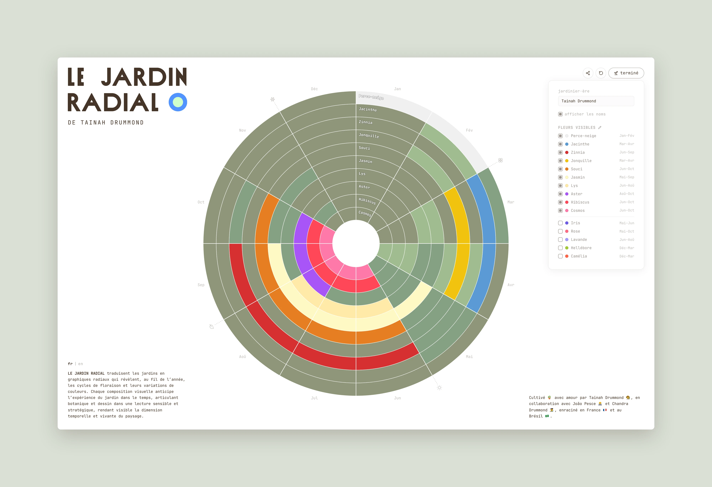

<p align="center">
  
</p>

<p align="center">
  <em>A chromatic cartography of the blooming year.</em>
</p>

<p align="center">
  <b>LE JARDIN RADIAL</b> translates gardens into radial graphics that reveal, throughout the year, blooming cycles and their color patterns. Each visual composition anticipates the garden's unfolding over time, articulating botany and design into a sensitive and strategic reading, making the temporal and chromatic dimensions of the landscape visible.
</p>

<p align="center">
  
</p>

<p align="center">
  <a href="https://jardin.pesce.cc"><strong>Live app</strong></a> · <a href="https://jardin.pesce.cc/components"><strong>Component library</strong></a>
  <br/><br/>
  <a href="https://github.com/jpesce/le-jardin-radial/actions/workflows/ci.yml"></a>
</p>

## Features

- 🌸 Radial chart visualizing blooming cycles and color patterns across the year
- 🌿 Create custom flowers or choose from the built-in catalog
- ✏️ Toggle and rearrange flowers to compose your garden
- 🖼️ Export your garden as SVG or high-res PNG
- 🔗 Share gardens via link or save as a file
- 🌍 Available in French and English
- 👤 Personalized colors derived from your name

<br/>

_Cultivated 🪴 with love by Tainah Drummond 👩‍🌾, in collaboration with João Pesce 👨‍💻 and Chandra Drummond 👩‍🎨, rooted in France 🇫🇷 and Brazil 🇧🇷._

<a href="https://creativecommons.org/licenses/by-nc-sa/4.0/"></a>

---

## Development

### Getting started

```bash
pnpm install        # requires node 22+ and pnpm
pnpm dev            # app at localhost:5173
pnpm storybook      # components at localhost:6006
pnpm screenshot     # regenerate README screenshot
```

### Testing & quality

```bash
pnpm test          # unit tests
pnpm test:e2e      # functional, visual regression, and accessibility tests
pnpm lint          # linting
pnpm typecheck     # type checking
```

To update visual regression baselines after intentional UI changes:

```bash
pnpm test:update-snapshots
```

---

<p align="center">
  <em>built on great open source</em>
  <br/><br/>
  TypeScript · React · Vite · D3.js · Tailwind CSS · Radix UI · shadcn · Framer Motion · Zustand · Storybook
  <br/>
  Vitest · Playwright · ESLint · Prettier · Husky · commitlint
</p>
