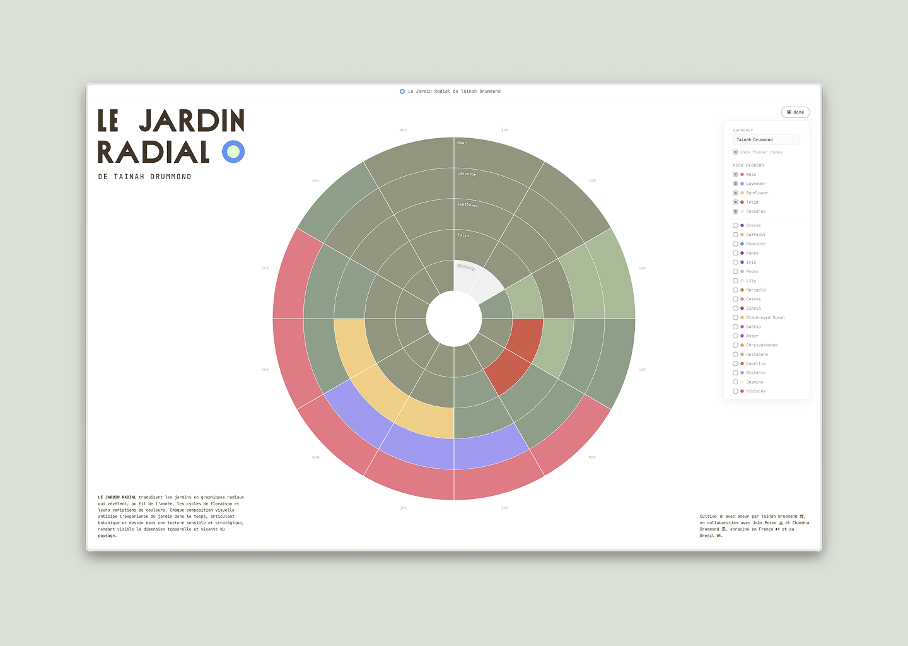

<p align="center">
  
</p>

<p align="center">
  <b>LE JARDIN RADIAL</b> translates gardens into radial graphics that reveal, throughout the year, blooming cycles and their color patterns. Each visual composition anticipates the garden's unfolding over time, articulating botany and design into a sensitive and strategic reading, making the temporal and living dimension of the landscape visible.
</p>

<p align="center">
  
</p>

<p align="center">
  <a href="https://jardin.pesce.cc"><strong>Live app</strong></a> · <a href="https://jardin.pesce.cc/components"><strong>Component library</strong></a>
</p>

## Features

- 🌸 Radial chart visualizing blooming cycles and color patterns across the year
- 🌿 Create custom flowers or choose from the built-in catalog
- ✏️ Toggle and rearrange flowers to compose your garden
- 🖼️ Export your garden as SVG or high-res PNG
- 🔗 Share gardens via link or save as a file
- 🌍 Available in French and English
- 👤 Personalized colors derived from your name

## Getting started

Prerequisites: [Node.js](https://nodejs.org/) (v22+) and [pnpm](https://pnpm.io/)

```bash
pnpm install
pnpm dev            # app at localhost:5173
pnpm storybook      # components at localhost:6006
```

## Tech stack

- **TypeScript** — strict mode with strictTypeChecked ESLint
- **React** + **Vite** — UI and build
- **D3.js** — radial chart
- **Tailwind CSS v4** — styling with design tokens
- **Zustand** — state management with persistence
- **Framer Motion** — animations
- **Lucide** — icons
- **lz-string** — URL sharing via compressed state

## Testing

```bash
pnpm test          # unit tests (vitest)
pnpm test:e2e      # functional + visual regression tests (playwright)
```

To update visual regression baselines after intentional UI changes:

```bash
pnpm exec playwright test e2e/visual.spec.js --update-snapshots
```

## Credits

Cultivated 🪴 with love by Tainah Drummond 👩‍🌾, in collaboration with João Pesce 👨‍💻 and Chandra Drummond 👩‍🎨, rooted in France 🇫🇷 and Brazil 🇧🇷.
